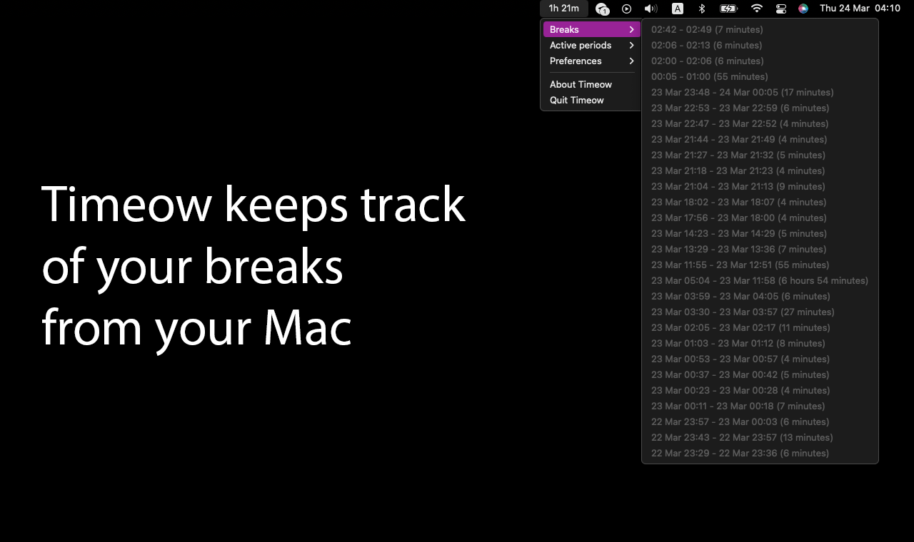
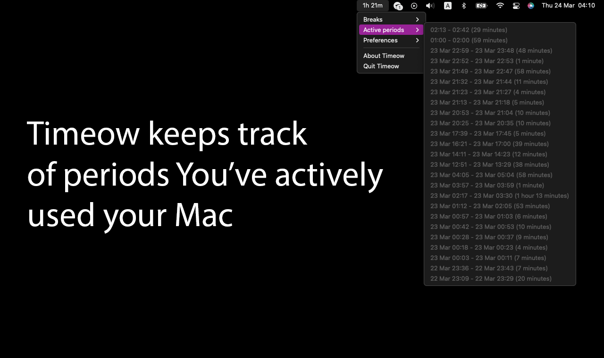
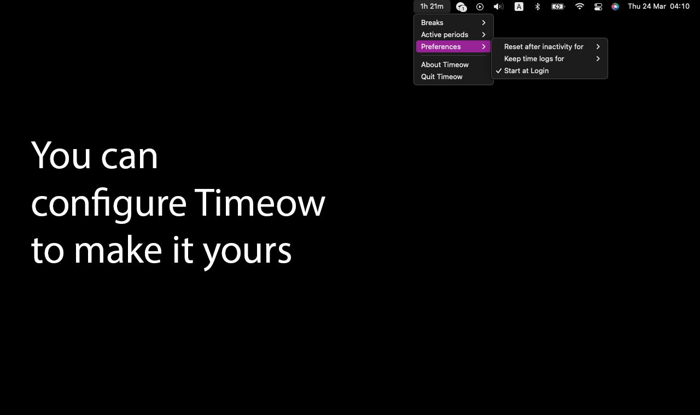
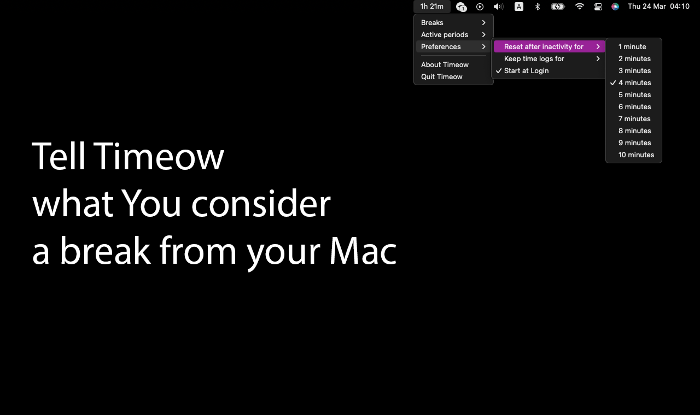
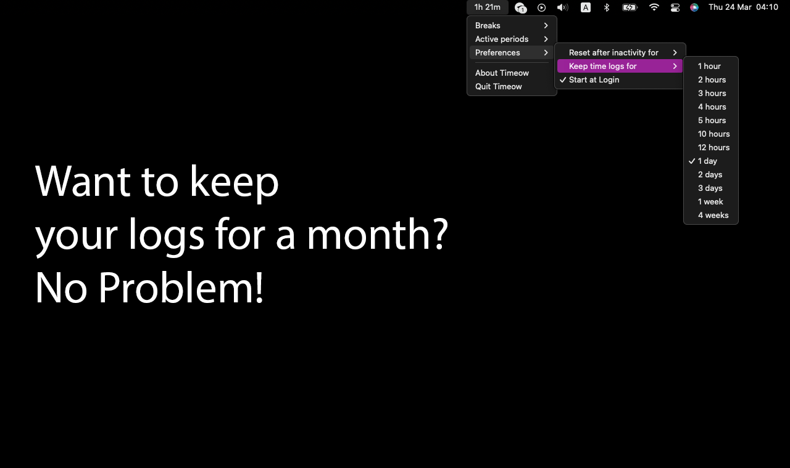

# Timeow

Timeow is an open-source macOS menu bar app that displays how long you've been
actively using your computer. It is configurable, and keeps track of active
sessions and breaks.











# Installation
### Binary releases
You can find binary versions of Timeow on the [Releases](https://github.com/f-person/timeow-mac/releases)
page on GitHub.

Please not that the binaries from Releases page are not signed so you will need
to the first time you'll need to open them by right clicking in Finder:
Finder -> Applications -> Timeow -> Right click -> Open.

### Building from source

In order to build a regular binary, you need to have a macOS machine with Go installed.
The following command will generate 3 versions of Timeow – `amd64`, `arm64`, and
a universal binary. They will be located in the `build` directory.
```sh
make build
```

If you want to build `Timeow.app`, you need a macOS machine with Go and Xcode.
```sh
make dist-mac-app
```

If you want to build a dmg, you need a macOS machine with Go, Xcode and
[create-dmg](https://github.com/create-dmg/create-dmg/).
```sh
make dist-mac-dmg
```
